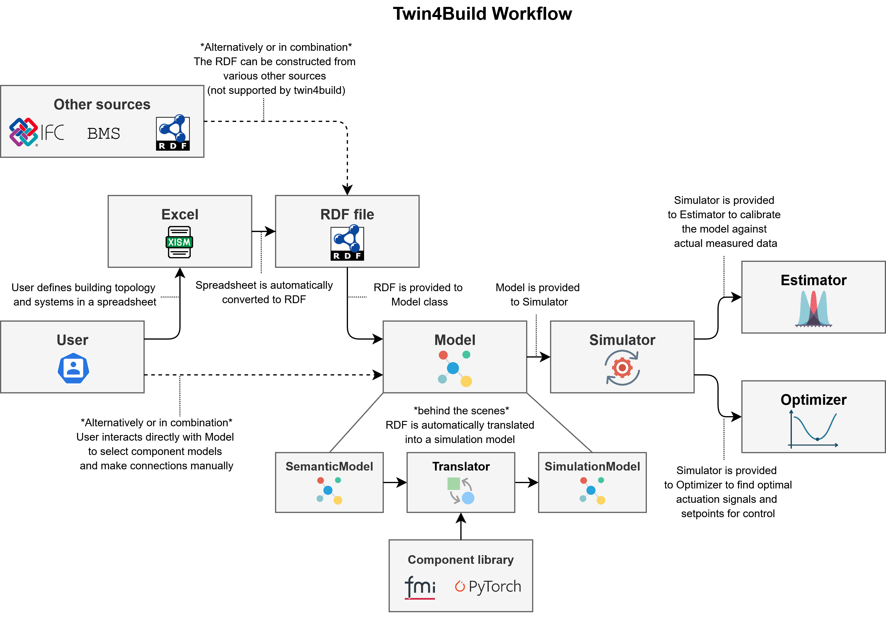

<p align="center">
    
</p>


[](https://twin4build.readthedocs.io/en/latest/)


# twin4build: A python package for Data-driven and Ontology-based modeling and simulation of buildings

twin4build is a python package which aims to provide a flexible and automated framework for dynamic modelling of indoor climate and energy consumption in buildings.


## Core Classes and Functionality

Twin4Build provides several top-level classes for building, simulating, translating, calibrating, and optimizing building energy models:

- **Model**:  
  The main container for your building system, components, and their connections. Use this class to assemble your digital twin from reusable components. 

- **Simulator**:  
  Runs time-based simulations of your Model, producing time series outputs for all components. Handles the simulation loop and time stepping.

- **Translator**:  
  Automatically generates a Model from a semantic model (ontology-based building description) and maintains a link between these. Enables ontology-driven, automated model creation.

- **Estimator**:  
  Performs parameter estimation (calibration) for your Model using measured data. Supports both least-squares and PyTorch-based optimization.

- **Optimizer**:  
  Optimizes building operation by adjusting setpoints or control variables to minimize objectives or satisfy constraints, using gradient-based methods.


All classes are accessible via the main package import:
```python
import twin4build as tb
```

A typical workflow would look like this:
<p align="center">
    
</p>


## Examples and Tutorials
Below are some examples of how to use the package.
More examples are coming soon.

### Basics of Twin4Build
+ <a target="_blank" href="https://colab.research.google.com/github/JBjoernskov/Twin4Build/blob/main/twin4build/examples/minimal_example.ipynb">
  </a> Part 1: Connecting components, simulating a model, and visualization

+ <a target="_blank" href="https://colab.research.google.com/github/JBjoernskov/Twin4Build/blob/main/twin4build/examples/space_co2_controller_example.ipynb">
  </a> Part 2: Modeling and control of indoor CO2 concentration

### Translator

+ <a target="_blank" href="https://colab.research.google.com/github/JBjoernskov/Twin4Build/blob/main/twin4build/examples/translator_example.ipynb">
  </a> Part 1: How to use the translator to generate simulation models from semantic models.


### Estimator

+ <a target="_blank" href="https://colab.research.google.com/github/JBjoernskov/Twin4Build/blob/main/twin4build/examples/estimator_example.ipynb">
  </a> Part 1: Basic parameter estimation and calibration


### Optimizer

+ <a target="_blank" href="https://colab.research.google.com/github/JBjoernskov/Twin4Build/blob/main/twin4build/examples/optimizer_example.ipynb">
  </a> Part 1: Optimization of space heater power consumption, constrained by heating and cooling setpoints.

<!-- ### Neural Policy Controller

+ <a target="_blank" href="https://colab.research.google.com/github/JBjoernskov/Twin4Build/blob/main/twin4build/examples/neural_policy_controller_example/neural_policy_example.ipynb">
  </a> Part 1: Training a neural policy controller for the space model -->

## Documentation
The documentation can be found [online](https://twin4build.readthedocs.io/en/latest/index.html).
Below is a code snippet showing the basic functionality of the package.
```python 
import twin4build as tb
import twin4build.utils.plot.plot as plot

model = tb.Model(id="example_model")

#Define a schedule for the damper position
position_schedule = tb.ScheduleSystem(
        weekDayRulesetDict = {
            "ruleset_default_value": 0,
            "ruleset_start_minute": [0,0,0,0,0,0,0],
            "ruleset_end_minute": [0,0,0,0,0,0,0],
            "ruleset_start_hour": [6,7,8,12,14,16,18],
            "ruleset_end_hour": [7,8,12,14,16,18,22],
            "ruleset_value": [0,0.1,1,0,0,0.5,0.7]}, #35
        add_noise=False,
        id="Position schedule")

# Define damper component
damper = tb.DamperSystem(
    nominalAirFlowRate = Measurement(hasValue=1.6),
    a=5,
    id="Damper")

# Add connections to the model
self.add_connection(position_schedule, damper, 
                    "scheduleValue", "damperPosition")

# Load the model 
model.load()

# Create a simulator instance
simulator = tb.Simulator(model)

# Simulate the model
stepSize = 600 #Seconds
startTime = datetime.datetime(year=2025, month=1, day=10, hour=0, minute=0, second=0) # Optionally set the timezone
endTime = datetime.datetime(year=2025, month=1, day=12, hour=0, minute=0, second=0) # Optionally set the timezone
simulator.simulate(stepSize=stepSize,
                   startTime=startTime,
                   endTime=endTime)

plot.plot_component(simulator, 
                    components_1axis=[("Damper", "airFlowRate")],
                    components_2axis=[("Damper", "damperPosition")],
                    ylabel_1axis="Air flow rate", #Optional
                    ylabel_2axis="Damper position", #Optional
                    show=True,
                    nticks=11)
```

<!--  -->


## Installation

| Python version  | Windows  | Ubuntu |
| :------------ |---------------:| -----:|
| 3.9 | [](https://github.com/JBjoernskov/Twin4Build/actions/workflows/win-py3-9.yml)        |    [](https://github.com/JBjoernskov/Twin4Build/actions/workflows/ub-py3-9.yml) |
| 3.10 | [](https://github.com/JBjoernskov/Twin4Build/actions/workflows/win-py3-10.yml)        |    [](https://github.com/JBjoernskov/Twin4Build/actions/workflows/ub-py3-10.yml) |
| 3.11 | [](https://github.com/JBjoernskov/Twin4Build/actions/workflows/win-py3-11.yml)        |    [](https://github.com/JBjoernskov/Twin4Build/actions/workflows/ub-py3-11.yml) |
| 3.12 | [](https://github.com/JBjoernskov/Twin4Build/actions/workflows/win-py3-12.yml)        |    [](https://github.com/JBjoernskov/Twin4Build/actions/workflows/ub-py3-12.yml) |

The package can be installed with pip and git using one of the above python versions:
```bat
pip install git+https://github.com/JBjoernskov/Twin4Build
```


### Graphviz
[Graphviz](https://graphviz.org/download) is used as a graph-drawing engine and must be installed separately:

#### Ubuntu
```bat
sudo add-apt-repository universe
sudo apt update
sudo apt install graphviz
```

#### Windows
On windows, the winget or choco package managers can be used:
```bat
winget install graphviz
```
```bat
choco install graphviz
```

#### MacOS
```bat
brew install graphviz
```


## Publications
<a id="1">[1]</a> 
[Bjørnskov, J. & Thomsen, A. & Jradi, M. (2025). Large-scale field demonstration of an interoperable and ontology-based energy modeling framework for building digital twins. Applied Energy, 387, [125597]](https://doi.org/10.1016/j.apenergy.2025.125597)

<a id="2">[2]</a> 
[Bjørnskov, J. & Jradi, M. & Wetter, M. (2025). Automated Model Generation and Parameter Estimation of Building Energy Models Using an Ontology-Based Framework. Energy and Buildings 329, [115228]](https://doi.org/10.1016/j.enbuild.2024.115228)

<a id="3">[3]</a> 
[Bjørnskov, J. & Jradi, M. (2023). An Ontology-Based Innovative Energy Modeling Framework for Scalable and Adaptable Building Digital Twins. Energy and Buildings, 292, [113146].](https://doi.org/10.1016/j.enbuild.2023.113146)

<a id="3">[4]</a> 
[Bjørnskov, J., Badhwar, A., Singh, D., Sehgal, M., Åkesson, R., & Jradi, M. (2025). Development and demonstration of a digital twin platform leveraging ontologies and data-driven simulation models. Journal of Building Performance Simulation, 1–13.](doi.org/10.1080/19401493.2025.2504005)

<a id="4">[5]</a> 
[Bjørnskov, J. & Jradi, M. (2023). Implementation and demonstration of an automated energy modeling framework for scalable and adaptable building digital twins based on the SAREF ontology. Building Simulation.](https://portal.findresearcher.sdu.dk/en/publications/implementation-and-demonstration-of-an-automated-energy-modeling-)

<a id="5">[6]</a> 
[Andersen, A. H. & Bjørnskov, J. & Jradi, M. (2023). Adaptable and Scalable Energy Modeling of Ventilation Systems as Part of Building Digital Twins. In Proceedings of the 18th International IBPSA Building Simulation Conference: BS2023 International Building Performance Simulation Association.](https://portal.findresearcher.sdu.dk/en/publications/adaptable-and-scalable-energy-modeling-of-ventilation-systems-as-)


## Cite as
```bibtex
@article{OntologyBasedBuildingModelingFramework,
    title = {An ontology-based innovative energy modeling framework for scalable and adaptable building digital twins},
    journal = {Energy and Buildings},
    volume = {292},
    pages = {113146},
    year = {2023},
    issn = {0378-7788},
    doi = {https://doi.org/10.1016/j.enbuild.2023.113146},
    url = {https://www.sciencedirect.com/science/article/pii/S0378778823003766},
    author = {Jakob Bjørnskov and Muhyiddine Jradi},
    keywords = {Digital twin, Data-driven, Building energy model, Building simulation, Ontology, SAREF},
}
```

