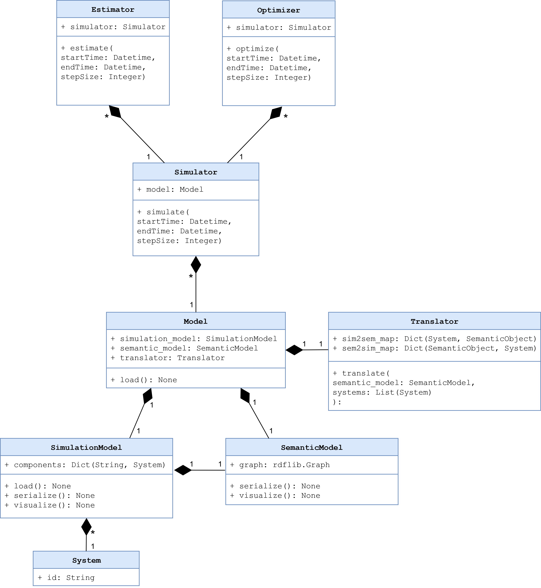

Developer Reference
========================================

A comprehensive guide for developers who want to contribute to Twin4Build.
This guide will help you understand the codebase structure, development workflow, and how to contribute effectively.

Architecture Overview
---------------------

Core Components
~~~~~~~~~~~~~~~

Twin4Build is organized around five main components which are exposed through the main module:

- **Model**: Container for building systems, components, and connections
- **Simulator**: Handles time-based simulations and time stepping
- **Translator**: Generates models from semantic descriptions
- **Estimator**: Performs parameter estimation and calibration
- **Optimizer**: Optimizes building operation and control

The **core**—Model, Simulator, Estimator, Optimizer, Translator and their interactions—must remain stable and predictable. **Adjacent modules** (e.g., component models and GPU backends) extend the system but must respect explicit boundaries, documented contracts, and shared interfaces so contributors understand how their work interacts with the foundations.

Package Structure
~~~~~~~~~~~~~~~~~

::

    twin4build/
    ├── core/           # Core functionality and base classes
    ├── model/          # Model components and building systems
    ├── simulator/      # Simulation engine and time stepping
    ├── translator/     # Semantic model translation
    ├── estimator/      # Parameter estimation and calibration
    ├── optimizer/      # Optimization algorithms
    ├── systems/        # Building system components
    ├── utils/          # Utility functions and helpers
    ├── examples/       # Example notebooks and scripts
    └── tests/          # Test suite

Development Environment Setup
-----------------------------

Prerequisites
~~~~~~~~~~~~~

- Python 3.9 or higher (3.12 recommended)
- Git
- A code editor (VS Code, PyCharm, etc.)
- **Conda** (recommended) or any Python environment manager

**Quick Start**: Use the automated setup script ``python scripts/setup_dev.py`` after cloning the repository for the fastest setup experience.

Installation from Source
~~~~~~~~~~~~~~~~~~~~~~~~

**Automated Setup (Recommended)**

The easiest way to set up your development environment is using the provided setup script:

.. code-block:: bash

    # Clone the repository
    git clone https://github.com/JBjoernskov/Twin4Build.git
    cd Twin4Build

    # Run the automated setup script
    python scripts/setup_dev.py

    # Or with custom options
    python scripts/setup_dev.py --python 3.12 --env t4bdev

**What the setup script does:**

- Creates a conda environment with your specified Python version (default: 3.12)
- Installs Twin4Build in development mode with all dependencies
- Runs the test suite to verify installation
- Provides clear next steps and available tools

**Script options:**

- ``--python VERSION``: Specify Python version (e.g., 3.9, 3.10, 3.11, 3.12)
- ``--env NAME``: Specify conda environment name (default: t4bdev)
- ``--help``: Show all available options

**Manual Setup (Alternative)**

If you prefer to set up manually or need a different environment manager:

.. code-block:: bash

    # Clone the repository
    git clone https://github.com/JBjoernskov/Twin4Build.git
    cd Twin4Build

    # Create conda environment
    conda create -n t4bdev python=3.12
    conda activate t4bdev

    # Install in development mode with dependencies
    pip install -e .[dev]

**Alternative environment managers**: You can also use venv, virtualenv, poetry, or pipenv - just ensure you have an isolated Python 3.9+ environment.

Code Style and Conventions
--------------------------

Python Style Guide
~~~~~~~~~~~~~~~~~~

- Follow PEP 8 style guidelines
- Use type hints for function parameters and return values
- Keep line length under 88 characters (Black formatter default)
- Use meaningful variable and function names

Naming Conventions
~~~~~~~~~~~~~~~~~~

- **Classes**: PascalCase (e.g., `Model`, `SpaceHeaterSystem`)
- **Functions and variables**: snake_case (e.g., `run_simulation`, `temperature_data`)
- **Module-level constants**: UPPER_SNAKE_CASE (e.g., `DEFAULT_TIMESTEP`)
- **Private methods**: prefix with underscore (e.g., `_internal_calculation`)
- **Private attributes**: prefix with underscore (e.g., `_components`)
- **Keys used in System.input and System.output dictionaries**: camelCase (e.g., `indoorTemperature`, `co2Concentration`)

Docstring Standards
~~~~~~~~~~~~~~~~~~~

Use Google-style docstrings and type hints:

.. code-block:: python

    def calculate_energy_consumption(self, temperature: float, duration: float) -> float:
        """Calculate energy consumption for a given temperature and duration.
        
        Args:
            temperature: The target temperature in Celsius
            duration: The duration in hours
            
        Returns:
            Energy consumption in kWh
            
        Raises:
            ValueError: If temperature is outside valid range
        """
        pass

For public class properties (acessed from outside the class), use the @property decorator:

.. code-block:: python

    class MyClass:
        @property
        def property_name(self) -> Any:
            """Description of the property."""
            return self._property_name
    
Avoid defining setter methods for public class properties unless necessary.
This way, we avoid accidently changing the value of a property.
If necessary, define a setter method for the property.

.. code-block:: python

    class MyClass:
        @property_name.setter
        def property_name(self, value: Any) -> None:
            """Description of the property."""
            self._property_name = value

Development Workflow
--------------------

Branching Strategy
~~~~~~~~~~~~~~~~~~

Twin4Build follows a disciplined branching model to keep development organized and reversible:

- **Main branch**: Stable releases only, updated through approved merges from dev branch
- **Dev branch**: Integration branch for completed features with tests and documentation
- **Feature branches**: Each feature lives in its own branch containing only logically related changes

  - Feature branches may have one level of sub-branching when needed
  - Once complete, features merge into dev (never directly into main)
  - Main contributors can make exemptions to this rule

Git Workflow
~~~~~~~~~~~~

1. **Create a GitHub issue** describing the work to be done

2. **Create a feature branch** from `dev` (or `main` if exempted):
   ::

       git checkout dev
       git pull origin dev
       git checkout -b feature/issue-XX/description

   Replace `XX` with the issue number and `description` with a brief description.

3. **Make your changes** and commit with descriptive message using imperative mood:
   ::

       git commit -m "Add new HVAC component for variable air volume systems"

4. **Push your branch** and create a pull request:
   ::

       git push origin feature/issue-XX/description

Branch Naming Conventions
~~~~~~~~~~~~~~~~~~~~~~~~~

All branches must reference a GitHub issue and follow this pattern: `type/issue-XX/description`

- `feature/issue-XX/description`: New features
- `bugfix/issue-XX/description`: Bug fixes
- `docs/issue-XX/description`: Documentation updates
- `test/issue-XX/description`: Test additions or improvements
- `refactor/issue-XX/description`: Code refactoring

**Examples:**

- `feature/issue-88/increase-test-coverage`
- `bugfix/issue-42/fix-simulator-memory-leak`
- `docs/issue-15/update-installation-guide`

Definition of Done
~~~~~~~~~~~~~~~~~~

A feature is considered "done" when:

- Functionality meets the agreed scope
- Code satisfies style guidelines (validated with ``python scripts/validate_code.py``)
- Tests (unit + integration) are included and pass
- Documentation is updated
- UML/architecture notes are provided when complexity requires it

This checklist ensures consistency, transparency, and predictable development velocity.

Pull Request Process
~~~~~~~~~~~~~~~~~~~~

1. **Run code validation**: `python scripts/validate_code.py`
2. **Run test suite locally**: Ensure all tests pass before pushing
3. Update documentation if needed
4. Add tests for new functionality
5. Provide UML diagrams or architecture notes for moderately complex features
6. Add examples if applicable
7. Request review from maintainers

Note: A pull request is required for any changes made to main and dev branches.

Testing
-------

Testing Strategy
~~~~~~~~~~~~~~~~

Twin4Build aims for a practical balance: ensure stability without over-engineering.

**Core Requirements:**

- All core features require component and integration tests to verify correctness of the Model→Simulator→Estimator→Optimizer chain
- **Public methods MUST have unit tests**
- **Private methods CAN have unit tests for critical functionality**
- Adjacent modules should include targeted tests to validate their interfaces with the core
- Before pushing to a branch, the test suite must be run locally to avoid pushing broken code

Tests serve two purposes: quality assurance and developer guidance, helping newcomers understand expected behavior.

Running Tests
~~~~~~~~~~~~~

Run the test suite using unittest:
::

    python -m unittest discover twin4build/tests/

Run specific test files:
::

    python -m unittest twin4build.tests.test_examples

Run with coverage:
::

    coverage run -m unittest discover twin4build/tests/
    coverage report
    coverage html  # Generate HTML coverage report

Alternatively, you can use pytest which provides cleaner output and better reporting.
pytest is fully compatible with unittest and requires no code changes.

Install pytest:
::

    pip install pytest pytest-html pytest-cov

Run the test suite using pytest:
::

    pytest twin4build/tests/

Run specific test files:
::

    pytest twin4build/tests/systems/junction/test_junction_systems.py

Run with verbose output:
::

    pytest twin4build/tests/ -v

Generate HTML test report:
::

    pytest twin4build/tests/ --html=report.html --self-contained-html

Run with coverage:
::

    pytest twin4build/tests/ --cov=twin4build --cov-report=html --cov-report=term-missing

Code Quality Validation
~~~~~~~~~~~~~~~~~~~~~~~

Before committing code, run the validation script to ensure your code meets Twin4Build standards:

**Check code quality** (recommended before every commit):
::

    python scripts/validate_code.py

**Auto-fix formatting issues**:
::

    python scripts/validate_code.py --fix

**Include test suite in validation**:
::

    python scripts/validate_code.py --test

**Combine options** (fix issues and run tests):
::

    python scripts/validate_code.py --fix --test

**What the validation script checks**:

- **Code formatting** (Black): Ensures consistent code style
- **Import sorting** (isort): Organizes import statements
- **Code style** (flake8): Checks for style violations, syntax errors, unused variables, etc.
- **File issues**: Trailing whitespace, missing newlines, etc.
- **Tests**: Runs the full test suite

**Manual tool usage** (if needed):
::

    # Format code
    black .
    
    # Sort imports (uses pyproject.toml config)
    isort .
    
    # Check style (uses .flake8 config)
    flake8 .

Writing Tests
~~~~~~~~~~~~~

Use unittest framework for all tests:

.. code-block:: python

    import unittest
    from twin4build import Model

    class TestModel(unittest.TestCase):
        
        def setUp(self):
            """Set up test fixtures."""
            self.model = Model()
        
        def test_component_addition(self):
            """Test adding components to model."""
            component = self.create_test_component()
            self.model.add_component(component)
            self.assertIn(component, self.model.components)
        
        def test_simulation_run(self):
            """Test basic simulation execution."""
            result = self.model.simulate(start_time=0, end_time=100, step_size=1)
            self.assertIsNotNone(result)
            self.assertGreater(len(result), 0)

    if __name__ == '__main__':
        unittest.main()

Test Organization
~~~~~~~~~~~~~~~~~

Organize tests using unittest's test discovery patterns:

- **Test files**: Named `test_*.py`
- **Test classes**: Inherit from `unittest.TestCase`
- **Test methods**: Start with `test_`

Advanced Testing Features
~~~~~~~~~~~~~~~~~~~~~~~~~

Use unittest's advanced features for better testing:

.. code-block:: python

    class TestAdvanced(unittest.TestCase):
        
        @unittest.skipIf(condition, "reason")
        def test_conditional_skip(self):
            """Skip test based on condition."""
            pass
        
        @unittest.expectedFailure
        def test_known_failure(self):
            """Mark test as expected to fail."""
            pass
        
        def test_with_subtest(self):
            """Use subtests for parameterized testing."""
            test_cases = [1, 2, 3, 4]
            for case in test_cases:
                with self.subTest(case=case):
                    self.assertTrue(case > 0)

Documentation
-------------

Documentation Standards
~~~~~~~~~~~~~~~~~~~~~~~

- Keep documentation up to date with code changes
- Include code examples for all public APIs
- Use clear, concise language
- Include diagrams and visual aids when helpful
- Follow reStructuredText formatting for manual pages

Architecture Documentation
~~~~~~~~~~~~~~~~~~~~~~~~~~

For moderately complex features, contributors should provide lightweight but effective architecture documentation:

- Small UML-style diagrams or flow charts summarizing class interactions
- Data flow diagrams when relevant
- Component lifecycle documentation
- Interface contracts and boundaries

This documentation supports knowledge transfer, helps reviewers rapidly understand intent, reduces onboarding friction, and prevents duplicate or conflicting design efforts.

**Note**: Features naturally change the architecture of the library over time. The goal of architecture documentation is not purely technical—it's communicational: to define a ubiquitous language for developer onboarding and establish a traceable history of architectural decisions.

Building Documentation
~~~~~~~~~~~~~~~~~~~~~~

Twin4Build uses Sphinx for documentation generation. The documentation build process requires **two steps**:

**Step 1: Generate API Documentation**

This step auto-generates API documentation from your Python docstrings:

.. code-block:: bash

    cd docs

    # On Windows:
    .\make buildapi

    # On Linux/Mac:
    make buildapi

**Step 2: Build HTML Documentation**

This step compiles all documentation (manual + API) into HTML:

.. code-block:: bash

    # On Windows:
    .\make html

    # On Linux/Mac:
    make html

**buildapi**: 
    - Scans your Python code for docstrings
    - Generates `.rst` files in `source/auto/`
    - Creates API reference documentation
    - Runs cleanup scripts

**html**:
- Compiles all `.rst` files (manual + auto-generated)
- Applies Sphinx theme
- Generates final HTML documentation
- Creates cross-references and search index

**View Documentation**

For viewing and browsing the documentation, open the `Twin4Build/build/html/index.html` file in your browser.

**Read the Docs versions**

Published docs:

- ``latest`` → ``main`` → https://twin4build.readthedocs.io/en/latest/
- ``dev`` → ``dev`` → https://twin4build.readthedocs.io/en/dev/ (activate once in the RTD project)

To make ``dev`` visible (project admins):

1. Open https://app.readthedocs.org/projects/twin4build/versions/
2. Find the ``dev`` version → **Activate** (and leave it public / not hidden)
3. Trigger a build for ``dev`` if one does not start automatically
4. Optional: add an Automation Rule so ``dev`` stays active on future syncs

Colab badges in :doc:`examples_and_tutorials` use the placeholder
``GITHUB_NOTEBOOK_BRANCH``, which ``docs/source/conf.py`` replaces with the
**docs build commit SHA** on Read the Docs (URL-encoded). Example notebooks
install Twin4Build with a plain ``T4B_REF`` string and
``!pip install ...@{T4B_REF}`` in the setup cell (edit that string for the
branch/tag/SHA you want; use ``refs/heads/...`` when the branch name contains
``/``).

Writing Documentation
~~~~~~~~~~~~~~~~~~~~~

**Manual Documentation**: Edit files in `docs/source/manual/`

**API Documentation**: Add docstrings to your Python code:

.. code-block:: python

    def calculate_energy(temperature: float, duration: float) -> float:
        """Calculate energy consumption for given conditions.
        
        This function computes energy usage based on temperature
        and duration parameters for building simulation.
        
        Args:
            temperature: Target temperature in Celsius
            duration: Time duration in hours
            
        Returns:
            Energy consumption in kWh
            
        Example:
            >>> energy = calculate_energy(22.0, 8.0)
            >>> print(f"Energy used: {energy} kWh")
            Energy used: 24.5 kWh
        """
        return temperature * duration * 1.2

Troubleshooting Documentation Build
~~~~~~~~~~~~~~~~~~~~~~~~~~~~~~~~~~~

**Common Issues:**

- **Sphinx not found**: Install dev dependencies with `pip install -e .[dev]`
- **Import errors in API docs**: Ensure Twin4Build is installed in development mode
- **Missing modules**: Check that all dependencies are installed
- **Build fails**: Try cleaning first: delete `docs/build/` and `docs/source/auto/` directories

**Clean Build:**

.. code-block:: bash

    # Remove generated files and rebuild
    cd docs
    rm -rf build/ source/auto/  # Linux/Mac
    rmdir /s build source\auto  # Windows
    
    # Then rebuild
    make buildapi && make html  # Linux/Mac
    .\make buildapi && .\make html  # Windows

Creating Examples
~~~~~~~~~~~~~~~~~

- Use Jupyter notebooks for examples
- Place examples in `twin4build/examples/`
- Include both basic and advanced use cases
- Ensure examples are self-contained and runnable
- After adding an example, also add it to the test suite: `twin4build/tests/test_examples.py`

Contributing Guidelines
-----------------------

Reporting Bugs
~~~~~~~~~~~~~~

- Provide python version and operating system
- Twin4Build version
- Minimal code example to reproduce the issue
- Expected vs. actual behavior
- Error messages and stack traces

Suggesting Features
~~~~~~~~~~~~~~~~~~~

- Describe the use case and motivation
- Provide examples of how the feature would be used
- Consider implementation complexity
- Discuss potential impacts on existing functionality
- Clearly distinguish whether the feature extends core functionality or is an adjacent module

Code Contribution Process
~~~~~~~~~~~~~~~~~~~~~~~~~

1. **Fork the repository** on GitHub
2. **Create a feature branch** following naming conventions
3. **Make your changes** following code style guidelines
4. **Add examples (optional)** for new functionality
5. **Add tests** for new functionality (required for public methods)
6. **Update documentation** as needed
7. **Add architecture documentation** if the feature is moderately complex
8. **Run the test suite** to ensure everything works
9. **Submit a pull request** with a clear description

Advanced Topics
---------------

Extending the Package
~~~~~~~~~~~~~~~~~~~~~

Creating Custom Components
^^^^^^^^^^^^^^^^^^^^^^^^^^

To create a custom component:

1. Inherit from :class:`~twin4build.systems.saref4syst.system.System` (exposed as ``twin4build.core.System``)
2. Declare the component's ``input`` and ``output`` ports as
   :class:`~twin4build.utils.types.Scalar` / :class:`~twin4build.utils.types.Vector`
   objects in ``__init__``
3. Implement ``initialize`` (allocate the port tensors for the simulation
   horizon) and ``do_step`` (advance the component one timestep)
4. Add proper type hints and documentation
5. Include tests for your component

Example (a minimal pass-through gate; see
:class:`~twin4build.systems.utils.on_off_system.OnOffSystem` for the full version):

.. code-block:: python

    import torch
    import twin4build.core as core
    import twin4build.utils.types as tps

    class CustomComponent(core.System):
        """Pass "value" through when "criteriaValue" >= threshold, else 0."""

        def __init__(self, threshold=0.5, **kwargs):
            super().__init__(**kwargs)
            self.threshold = threshold
            self.input = {"value": tps.Scalar(), "criteriaValue": tps.Scalar()}
            self.output = {"value": tps.Scalar()}

        def initialize(self, start_time, end_time, step_size):
            _, _, max_timesteps, _ = core.Simulator.get_simulation_timesteps(
                start_time, end_time, step_size
            )
            batch_size = len(start_time)
            for port in list(self.input.values()) + list(self.output.values()):
                port.initialize(n_t=max_timesteps, n_s=batch_size)

        def do_step(self, second_time, date_time, step_size, step_index):
            criteria = self.input["criteriaValue"].get()
            value = self.input["value"].get()
            out = torch.where(criteria >= self.threshold, value, torch.zeros_like(value))
            self.output["value"]._set(out, i_t=step_index)

The ``do_step``/``forward`` contract
^^^^^^^^^^^^^^^^^^^^^^^^^^^^^^^^^^^^

Components that should be usable by the *fast* estimation paths (the
``options={"fast": True}`` single-shooting objective and the collocation
transcription's composed Jacobian) additionally implement a **pure**
``forward(state, inputs, parameters, ...)`` method: a side-effect-free
function from tensors to tensors. For such components, ``do_step`` MUST be a
thin port-I/O wrapper that reads its inputs from the ports, delegates all
math to ``forward``, and writes the results back to the output ports. This
single-source-of-truth rule guarantees by construction that the composed
one-step map used by the Estimator computes exactly what the object-graph
simulation computes -- the two cannot drift apart, because there is only one
implementation of the physics. Components without ``forward`` still work
everywhere else; the estimator silently falls back to the object-graph
objective for models containing them.

Performance Considerations
~~~~~~~~~~~~~~~~~~~~~~~~~~

- Always use torch operations to enable automatic differentiation
- Use vectorized operations when possible
- Profile code to identify bottlenecks

Debugging Tips
~~~~~~~~~~~~~~

- Use logging for debugging information
- Set breakpoints in your IDE
- Use `pdb` for interactive debugging
- Check component connections and data flow

Release Process
---------------

Version Management
~~~~~~~~~~~~~~~~~~

Twin4Build follows semantic versioning (MAJOR.MINOR.PATCH) to maintain clarity for users and contributors:

- **MAJOR**: Structural changes to the core or breaking interface updates
- **MINOR**: New features or non-breaking improvements
- **PATCH**: Hotfixes and stability updates

Version updates occur in both **dev** and **main** branches:

- Every merge into the dev branch bumps the version number with a pre-release tag
- Main branch receives version updates only for stable releases

Building and Distributing
~~~~~~~~~~~~~~~~~~~~~~~~~

1. Update version number in `pyproject.toml`
2. Run full test suite
3. Build documentation
4. Create release notes for significant changes
5. Tag releases in Git
6. Create distribution:
   ::

       python -m build

7. Upload to PyPI (maintainers only)

Getting Help
------------

- **GitHub Issues**: For bug reports and feature requests
- **Documentation**: Check the online docs first
- **Examples**: Review the example notebooks
- **Code**: Examine the source code and tests

Contact Information
~~~~~~~~~~~~~~~~~~~

- **Maintainer**: Jakob Bjørnskov (jabj@mmmi.sdu.dk)
- **GitHub**: https://github.com/JBjoernskov/Twin4Build/
- **Documentation**: https://twin4build.readthedocs.io/
