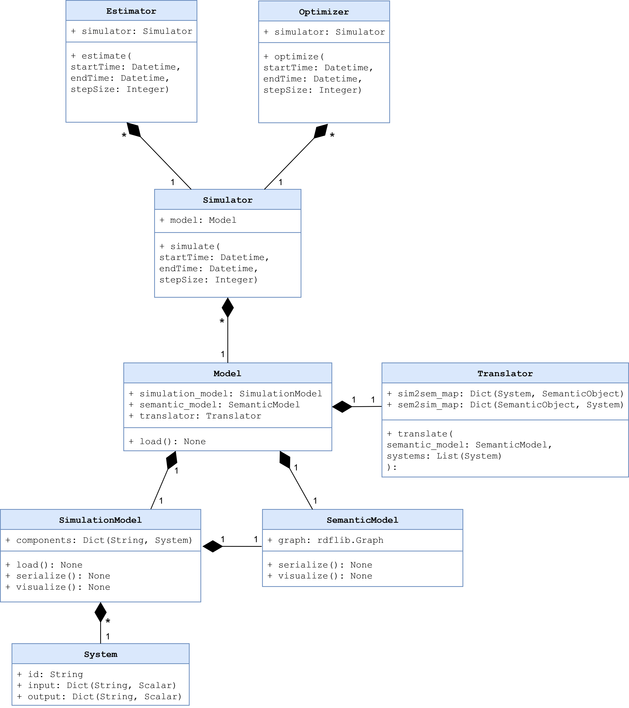

Developer Reference
========================================

A comprehensive guide for developers who want to contribute to Twin4Build.
This guide will help you understand the codebase structure, development workflow, and how to contribute effectively.

Architecture Overview
--------------------

Core Components
~~~~~~~~~~~~~~~

Twin4Build is organized around five main components which are exposed through the main module:

- **Model**: Container for building systems, components, and connections
- **Simulator**: Handles time-based simulations and time stepping
- **Translator**: Generates models from semantic descriptions
- **Estimator**: Performs parameter estimation and calibration
- **Optimizer**: Optimizes building operation and control

Package Structure
~~~~~~~~~~~~~~~~~

::

    twin4build/
    ├── core/           # Core functionality and base classes
    ├── model/          # Model components and building systems
    ├── simulator/      # Simulation engine and time stepping
    ├── translator/     # Semantic model translation
    ├── estimator/      # Parameter estimation and calibration
    ├── optimizer/      # Optimization algorithms
    ├── systems/        # Building system components
    ├── utils/          # Utility functions and helpers
    ├── examples/       # Example notebooks and scripts
    └── tests/          # Test suite

Development Environment Setup
----------------------------

Prerequisites
~~~~~~~~~~~~~

- Python 3.9 or higher (3.12 recommended)
- Git
- A code editor (VS Code, PyCharm, etc.)
- **Conda** (recommended) or any Python environment manager

**Quick Start**: Use the automated setup script ``python scripts/setup_dev.py`` after cloning the repository for the fastest setup experience.

Installation from Source
~~~~~~~~~~~~~~~~~~~~~~~~

**Automated Setup (Recommended)**

The easiest way to set up your development environment is using the provided setup script:

.. code-block:: bash

    # Clone the repository
    git clone https://github.com/JBjoernskov/Twin4Build.git
    cd Twin4Build

    # Run the automated setup script
    python scripts/setup_dev.py

    # Or with custom options
    python scripts/setup_dev.py --python 3.12 --env t4bdev

**What the setup script does:**

- Creates a conda environment with your specified Python version (default: 3.12)
- Installs Twin4Build in development mode with all dependencies
- Runs the test suite to verify installation
- Provides clear next steps and available tools

**Script options:**

- ``--python VERSION``: Specify Python version (e.g., 3.9, 3.10, 3.11, 3.12)
- ``--env NAME``: Specify conda environment name (default: t4bdev)
- ``--help``: Show all available options

**Manual Setup (Alternative)**

If you prefer to set up manually or need a different environment manager:

.. code-block:: bash

    # Clone the repository
    git clone https://github.com/JBjoernskov/Twin4Build.git
    cd Twin4Build

    # Create conda environment
    conda create -n t4bdev python=3.12
    conda activate t4bdev

    # Install in development mode with dependencies
    pip install -e .[dev]

**Alternative environment managers**: You can also use venv, virtualenv, poetry, or pipenv - just ensure you have an isolated Python 3.9+ environment.

Code Style and Conventions
-------------------------

Python Style Guide
~~~~~~~~~~~~~~~~~~

- Follow PEP 8 style guidelines
- Use type hints for function parameters and return values
- Keep line length under 88 characters (Black formatter default)
- Use meaningful variable and function names

Naming Conventions
~~~~~~~~~~~~~~~~~

- **Classes**: PascalCase (e.g., `Model`, `SpaceHeaterSystem`)
- **Functions and variables**: snake_case (e.g., `run_simulation`, `temperature_data`)
- **Module-level constants**: UPPER_SNAKE_CASE (e.g., `DEFAULT_TIMESTEP`)
- **Private methods**: prefix with underscore (e.g., `_internal_calculation`)
- **Private attributes**: prefix with underscore (e.g., `_components`)
- **Keys used in System.input and System.output dictionaries**: camelCase (e.g., `indoorTemperature`, `co2Concentration`)

Docstring Standards
~~~~~~~~~~~~~~~~~~

Use Google-style docstrings and type hints:

.. code-block:: python

    def calculate_energy_consumption(self, temperature: float, duration: float) -> float:
        """Calculate energy consumption for a given temperature and duration.
        
        Args:
            temperature: The target temperature in Celsius
            duration: The duration in hours
            
        Returns:
            Energy consumption in kWh
            
        Raises:
            ValueError: If temperature is outside valid range
        """
        pass

For class properties, use the @property decorator:

.. code-block:: python

    class MyClass:
        @property
        def property_name(self) -> float:
            """Description of the property."""

Development Workflow
-------------------

Git Workflow
~~~~~~~~~~~

1. **Create a feature branch** from `main`:
   ::

       git checkout -b feature/your-feature-name

2. **Make your changes** and commit with descriptive message using imperative mood:
   ::

       git commit -m "Add new HVAC component for variable air volume systems"

3. **Push your branch** and create a pull request:
   ::

       git push origin feature/your-feature-name

Branch Naming Conventions
~~~~~~~~~~~~~~~~~~~~~~~~

- `feature/description`: New features
- `bugfix/description`: Bug fixes
- `docs/description`: Documentation updates
- `test/description`: Test additions or improvements
- `refactor/description`: Code refactoring

Pull Request Process
~~~~~~~~~~~~~~~~~~~

1. **Run code validation**: `python scripts/validate_code.py`
2. Update documentation if needed
3. Add tests for new functionality
4. Add examples if applicable
5. Request review from maintainers

Testing
-------

Running Tests
~~~~~~~~~~~~

Run the test suite using unittest:
::

    python -m unittest discover twin4build/tests/

Run specific test files:
::

    python -m unittest twin4build.tests.test_examples

Run with coverage:
::

    coverage run -m unittest discover twin4build/tests/
    coverage report
    coverage html  # Generate HTML coverage report

Code Quality Validation
~~~~~~~~~~~~~~~~~~~~~~

Before committing code, run the validation script to ensure your code meets Twin4Build standards:

**Check code quality** (recommended before every commit):
::

    python scripts/validate_code.py

**Auto-fix formatting issues**:
::

    python scripts/validate_code.py --fix

**Include test suite in validation**:
::

    python scripts/validate_code.py --test

**Combine options** (fix issues and run tests):
::

    python scripts/validate_code.py --fix --test

**What the validation script checks**:

- **Code formatting** (Black): Ensures consistent code style
- **Import sorting** (isort): Organizes import statements
- **Code style** (flake8): Checks for style violations, syntax errors, unused variables, etc.
- **File issues**: Trailing whitespace, missing newlines, etc.
- **Tests**: Runs the full test suite

**Manual tool usage** (if needed):
::

    # Format code
    black .
    
    # Sort imports (uses pyproject.toml config)
    isort .
    
    # Check style (uses .flake8 config)
    flake8 .

Writing Tests
~~~~~~~~~~~~

- Place tests in the `twin4build/tests/` directory
- Use descriptive test names starting with `test_`
- Test both success and failure cases
- Use setUp and tearDown methods for common setup

Example test structure:
::

    import unittest
    from twin4build import Model

    class TestModel(unittest.TestCase):
        """Test cases for the Model class."""
        
        def setUp(self):
            """Set up test fixtures before each test method."""
            self.model = Model(id="test_model")
        
        def test_model_creation(self):
            """Test that a model can be created with basic parameters."""
            self.assertEqual(self.model.id, "test_model")
            self.assertEqual(self.model.components, [])
        
        def tearDown(self):
            """Clean up after each test method."""
            pass

    if __name__ == '__main__':
        unittest.main()

Test Organization
~~~~~~~~~~~~~~~~

Organize tests using unittest's test discovery patterns:

- **Test files**: Named `test_*.py`
- **Test classes**: Inherit from `unittest.TestCase`
- **Test methods**: Start with `test_`

Advanced Testing Features
~~~~~~~~~~~~~~~~~~~~~~~~~

Use unittest's advanced features for better testing:

.. code-block:: python

    class TestAdvanced(unittest.TestCase):
        
        @unittest.skipIf(condition, "reason")
        def test_conditional_skip(self):
            """Skip test based on condition."""
            pass
        
        @unittest.expectedFailure
        def test_known_failure(self):
            """Mark test as expected to fail."""
            pass
        
        def test_with_subtest(self):
            """Use subtests for parameterized testing."""
            test_cases = [1, 2, 3, 4]
            for case in test_cases:
                with self.subTest(case=case):
                    self.assertTrue(case > 0)

Documentation
------------

Building Documentation
~~~~~~~~~~~~~~~~~~~~~

Twin4Build uses Sphinx for documentation generation. The documentation build process requires **two steps**:

**Step 1: Generate API Documentation**

This step auto-generates API documentation from your Python docstrings:

.. code-block:: bash

    cd docs

    # On Windows:
    .\make buildapi

    # On Linux/Mac:
    make buildapi

**Step 2: Build HTML Documentation**

This step compiles all documentation (manual + API) into HTML:

.. code-block:: bash

    # On Windows:
    .\make html

    # On Linux/Mac:
    make html

**buildapi**: 
    - Scans your Python code for docstrings
    - Generates `.rst` files in `source/auto/`
    - Creates API reference documentation
    - Runs cleanup scripts

**html**:
- Compiles all `.rst` files (manual + auto-generated)
- Applies Sphinx theme
- Generates final HTML documentation
- Creates cross-references and search index

**View Documentation**

For viewing and browsing the documentation, open the `Twin4Build/build/html/index.html` file in your browser.

Documentation Standards
~~~~~~~~~~~~~~~~~~~~~~

- Keep documentation up to date with code changes
- Include code examples for all public APIs
- Use clear, concise language
- Include diagrams and visual aids when helpful
- Follow reStructuredText formatting for manual pages

Writing Documentation
~~~~~~~~~~~~~~~~~~~~

**Manual Documentation**: Edit files in `docs/source/manual/`

**API Documentation**: Add docstrings to your Python code:

.. code-block:: python

    def calculate_energy(temperature: float, duration: float) -> float:
        """Calculate energy consumption for given conditions.
        
        This function computes energy usage based on temperature
        and duration parameters for building simulation.
        
        Args:
            temperature: Target temperature in Celsius
            duration: Time duration in hours
            
        Returns:
            Energy consumption in kWh
            
        Example:
            >>> energy = calculate_energy(22.0, 8.0)
            >>> print(f"Energy used: {energy} kWh")
            Energy used: 24.5 kWh
        """
        return temperature * duration * 1.2

Troubleshooting Documentation Build
~~~~~~~~~~~~~~~~~~~~~~~~~~~~~~~~~~

**Common Issues:**

- **Sphinx not found**: Install dev dependencies with `pip install -e .[dev]`
- **Import errors in API docs**: Ensure Twin4Build is installed in development mode
- **Missing modules**: Check that all dependencies are installed
- **Build fails**: Try cleaning first: delete `docs/build/` and `docs/source/auto/` directories

**Clean Build:**

.. code-block:: bash

    # Remove generated files and rebuild
    cd docs
    rm -rf build/ source/auto/  # Linux/Mac
    rmdir /s build source\auto  # Windows
    
    # Then rebuild
    make buildapi && make html  # Linux/Mac
    .\make buildapi && .\make html  # Windows

Creating Examples
~~~~~~~~~~~~~~~~~

- Use Jupyter notebooks for examples
- Place examples in `twin4build/examples/`
- Include both basic and advanced use cases
- Ensure examples are self-contained and runnable
- After adding an example, also add it to the test suite: `twin4build/tests/test_examples.py`

Contributing Guidelines
----------------------

Reporting Bugs
~~~~~~~~~~~~~

- Provide python version and operating system
- Twin4Build version
- Minimal code example to reproduce the issue
- Expected vs. actual behavior
- Error messages and stack traces

Suggesting Features
~~~~~~~~~~~~~~~~~~

- Describe the use case and motivation
- Provide examples of how the feature would be used
- Consider implementation complexity
- Discuss potential impacts on existing functionality

Code Contribution Process
~~~~~~~~~~~~~~~~~~~~~~~~~

1. **Fork the repository** on GitHub
2. **Create a feature branch** following naming conventions
3. **Make your changes** following code style guidelines
4. **Add examples (optional)** for new functionality
5. **Add tests** for new functionality
6. **Update documentation** as needed
7. **Run the test suite** to ensure everything works
8. **Submit a pull request** with a clear description

Advanced Topics
--------------

Extending the Package
~~~~~~~~~~~~~~~~~~~~

Creating Custom Components
^^^^^^^^^^^^^^^^^^^^^^^^^

To create a custom component:

1. Inherit from :class:`~twin4build.systems.saref4syst.system.System` and either :class:`~torch.nn.Module` or :class:`~twin4build.systems.utils.fmu_system.FMUSystem`
2. Implement required methods
3. Add proper type hints and documentation
4. Include tests for your component

Example:
::
    class CustomHVACComponent(System):
        """Custom HVAC component for specific use case."""
        
        def __init__(self, **kwargs):
            super().__init__(**kwargs)
            # Initialize component-specific attributes

        def initialize(self, start_time=None, end_time=None, step_size=None, simulator=None):
            super().__init__(**kwargs)
            # Initialize component-specific attributes
            
        def do_step(self, secondTime, dateTime, step_size, stepIndex):
            """Perform one simulation step."""
            # Implement simulation logic
            pass

Performance Considerations
~~~~~~~~~~~~~~~~~~~~~~~~~

- Always use torch operations to enable automatic differentiation
- Use vectorized operations when possible
- Profile code to identify bottlenecks

Debugging Tips
~~~~~~~~~~~~~

- Use logging for debugging information
- Set breakpoints in your IDE
- Use `pdb` for interactive debugging
- Check component connections and data flow

Release Process
--------------

Version Management
~~~~~~~~~~~~~~~~~

- Follow semantic versioning (MAJOR.MINOR.PATCH)
- Update version in `pyproject.toml`
- Create release notes for significant changes
- Tag releases in Git

Building and Distributing
~~~~~~~~~~~~~~~~~~~~~~~~~

1. Update version number
2. Run full test suite
3. Build documentation
4. Create distribution:
   ::

       python -m build

5. Upload to PyPI (maintainers only)

Getting Help
-----------

- **GitHub Issues**: For bug reports and feature requests
- **Documentation**: Check the online docs first
- **Examples**: Review the example notebooks
- **Code**: Examine the source code and tests

Contact Information
~~~~~~~~~~~~~~~~~~

- **Maintainer**: Jakob Bjørnskov (jabj@mmmi.sdu.dk)
- **GitHub**: https://github.com/JBjoernskov/Twin4Build/
- **Documentation**: https://twin4build.readthedocs.io/